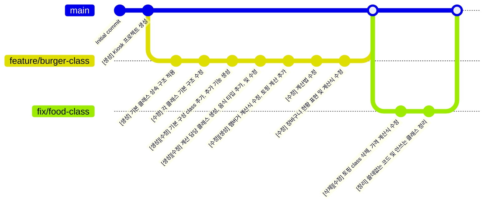

# 🚀 디벨로켓 1차 정규 테스트

## 📚 과목
### `⌨️ 프로그래밍 언어`

## 🎯 목표
### `📺 가게 주문 판매용 kiosk`

## 👟 구현 과정
  ✴️ 가게 이름, 판매 제품, 금액 등에 관하여 계획 수립

1. 기본 동작 method 및 필드가 포함된 class 생성

2. class 상속 관계 및 interface 구성, 연결

3. method 세부 내용 작성

4. 기본 제공 consoleinput.cs 적용

5. 중간 테스트 및 확인

6. 확인 과정 중 발견된 문제점, 보완점 적용

7. 추가 수정 사항 및 계산식 수정

8. 최종 테스트

9. 불필요한 class 및 unused cs 파일 정리

  ❇️ 최종 merge 작업 및 제출

## 💣 TroubleShooting
### 📜 설계의도
```csharp
interface IToppingable 를 상속한 class Burger 에서 class Topping 추가시
OnCalculate 에서 Topping 의 가격을 Burger 의 가격에 추가해서 계산하도록 설계
```

### ⛔ 문제 발생
```csharp
1 개 의 Burger 주문시에는 정상 적동하나 2개 이상 같은 Burger 를 추가시
기존 Topping 의 가격이 새로운 Topping 의 가격으로 계산되는 현상이 발생 
```

### ♻️ 해결
```csharp
class Topping 과 interface IToppingable 를 삭제하고 다른 계산 방식을 적용하여 해결
```

## 🌳 Branch Tree



## 💭 회고
```Textbox
>> Unity 없이 C# 자체로만 Program을 구현하는 것이 오랜만이라 색다른 경험이었음

>> TroubleShooting 에서 발생한 문제를 원래 설계 의도데로 구현하려고 하였으나
과제 제출 남은 시간이 많지 않아 원인을 제거하는 방식으로 해결할 수 밖에 없었음

>> 차라리 Topping 추가 방식을 다르게 하거나 추가 결제 방식으로
우회하여 구현 하였으면 시간을 덜 투자해 설계 의도대로 구현할 수 있지 않았을까 생각함
```
